# School_District_Analysis
## Overview
 A school district requested an analysis of reading and math peformance of high schoolers. 

 They have asked for the following analysis:
 * A District level summary
 * A summery by each high school
 * Performance by each grade level
 * Performance by per capita spending
 * Performance by size of student population
 * Performance by type of school

 ### Academic Integerity Problem

 During the analysis, it was found that 9th grade students at Thomas High School (THS) may have violeted academic integerity. Therefore, the analysis was performed again with THS 9th graders removed from the analysis.

 The results section will compare each data product with that subset of students in and out of the analysis.

## Results
* THS 9th Graders Effect on district summary analysis:

    The first image is the orignal analysis and the second is with THS 9th graders removed.

    
    

    As can be seen from dataframes above, there is only a slight decrease in average math scores.

* THS 9th Graders Effect on school summary analysis:

    The first image is the orignal analysis and the second is with THS 9th graders removed.

    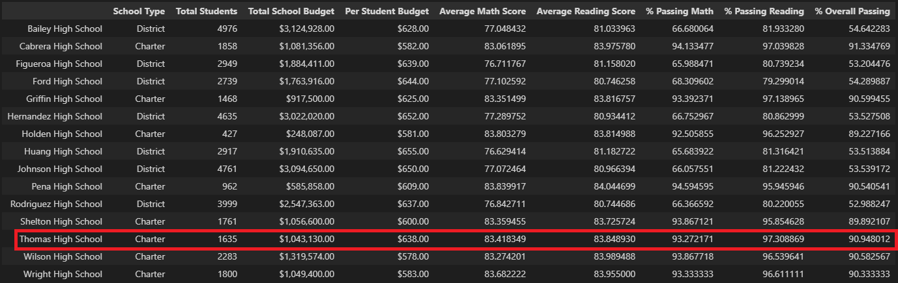
    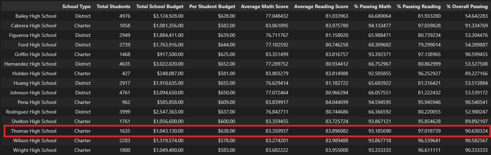

    Thomas High School is highlighted in red. As can be seen, the removal of the 9th graders has only a slight affect on the math and reading grades.

* THS 9th Graders Effect on school rankings:

    * Top 5 Schools

    The first image is the orignal analysis and the second is with THS 9th graders removed.

    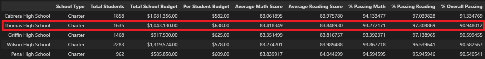
    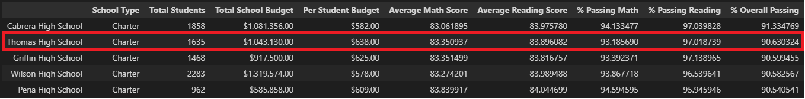

    The removal of the THS 9th graders does not affect the top 5 ranking and THS remains in second place whether the 9th graders are removed or not.

    * Bottom 5 Schools

    The first image is the orignal analysis and the second is with THS 9th graders removed.

    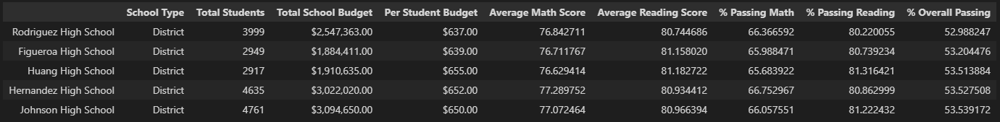
    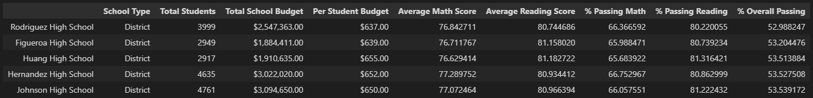

    No change in bottom 5 school listings.

* THS 9th graders effect on math and reading scores by grade:

    * Math by Grade 

    The first image is the orignal analysis and the second is with THS 9th graders removed.

    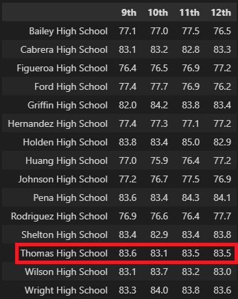
    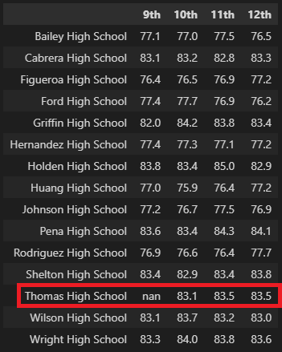

    The only change is that THS 9th graders show nan for their math scores. All other values are the same.

    * Reading by Grade

    The first image is the orignal analysis and the second is with THS 9th graders removed.

    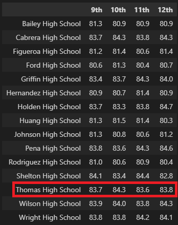
    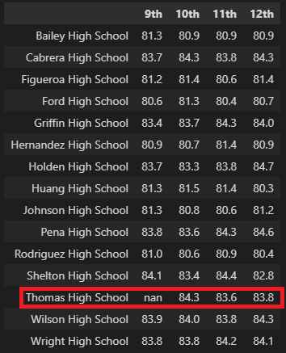

    The only change is that THS 9th graders show nan for their reading scores. All other values are the same.

* THS 9th graders effect scores by school spending:

    The first image is the orignal analysis and the second is with THS 9th graders removed.

    
    

    No changes in the by spending per capita analysis.

* THS 9th graders effect scores by school size:

    The first image is the orignal analysis and the second is with THS 9th graders removed.

    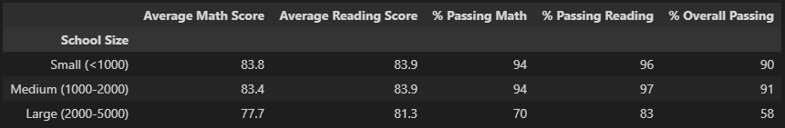
    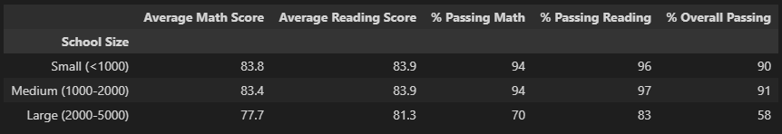

    No changes in the by size analysis.

* THS 9th graders effect scores by school type:

    The first image is the orignal analysis and the second is with THS 9th graders removed.

    
    

    No changes in the by type analysis.

## Summary

The removal of the Thomas High School 9th graders slighly impacted a few values. This should be expected given the Thomas High School 9th grade population is only about 420 students and their math and reading scores were comparable to the scores of the Thomas High School 10 through 12th graders.

The following changes can be attributed to the removal of the Thomas High School 9th graders:

    1. A 0.1% drop in the district average math score can be observed.
    2. In the school summary table, the greatest changes were in the percent passing math, reading, and overall by a difference of about 0.3%.
    3. The math scores by grade now have an nan in the 9th grade column for Thomas High School
    4. The reading scores by grade now have an nan in the 9th grade column for Thomas High School
    5. The code itself has a section using the loc method to find and replace the score of 9th grade students from Thomas High School with nan.